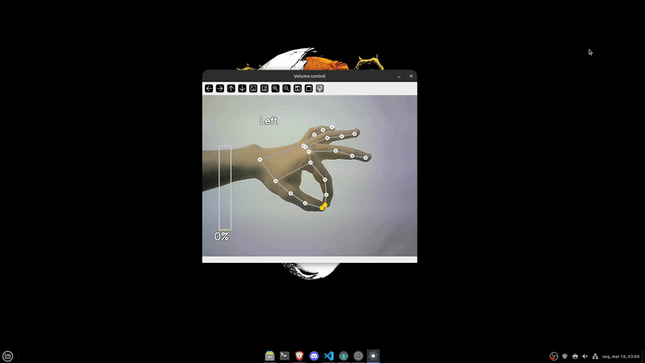
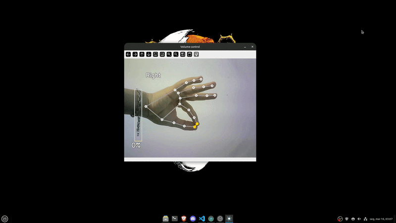

# HandTune

## About 📝

HandTune is a computer vision project that allows users to control their system's audio volume using hand gestures captured by a webcam!

The application uses real-time hand tracking to detect the position of the thumb and index finger. The distance between these two fingers determines the system volume level: the closer they are, the lower the volume; the farther apart they are, the higher the volume.

The project was developed in **Python**, using **OpenCV** for video processing and **MediaPipe** for hand landmark detection.

## Features ✨

- Real-time hand tracking using MediaPipe ✋
- System volume control through finger gestures 🔊  
- Visual feedback of hand landmarks and finger distance 🎥  
- Lightweight and easy to run ⚡

## Preview 👀

   
   

## How to install and Run HandTune ⚙️

1. Enter the releases page on the repository 📁
2. Download the latest version inside the page and run it 🖥️

## Requirements

- Webcam or any live camera device 📷

## Contribution 🤝

Contributions are welcome! If you want to help improve this project, follow the steps below:

1. Fork the repository. 🍴
2. Create a branch for your feature (`git checkout -b my-feature`). 🌱
3. Make your changes and commit (`git commit -m 'Add new feature'`). ✍️
4. Push to the branch (`git push origin my-feature`). 🚀
5. Open a Pull Request. 📥
